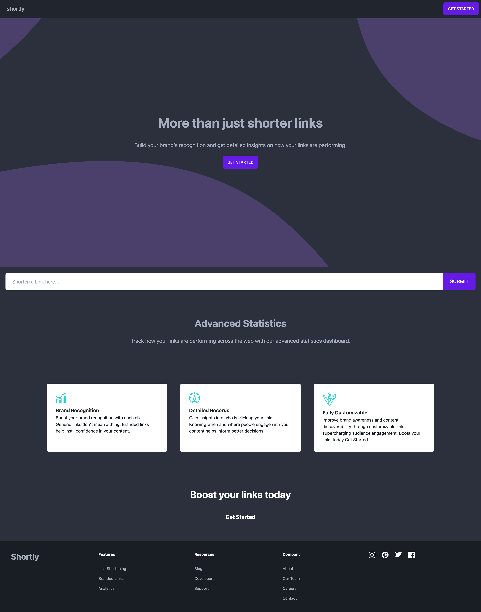

# Shortly

## Description

Shortly is a URL shortening service that uses the shrtco.de API. Created with Vite, React, TailwindCSS, and DaisyUI.

## Installation

run `npm i` to install dependencies. Use `npm run dev` for running the dev build, and `npm run build` to compile a deployable version.

### Screenshots

